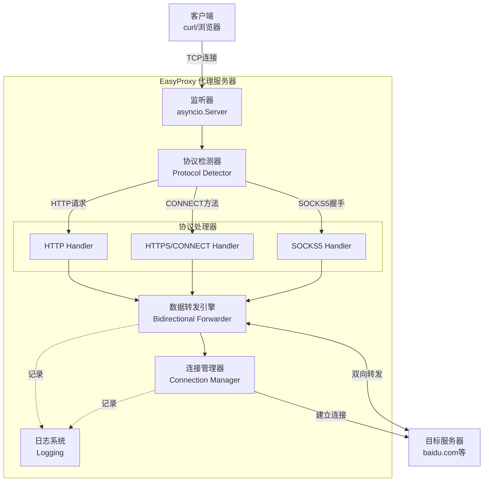
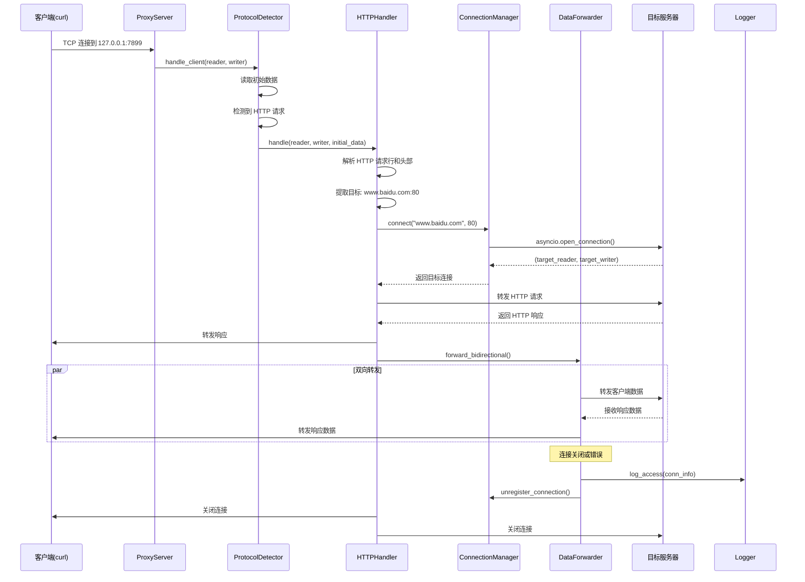
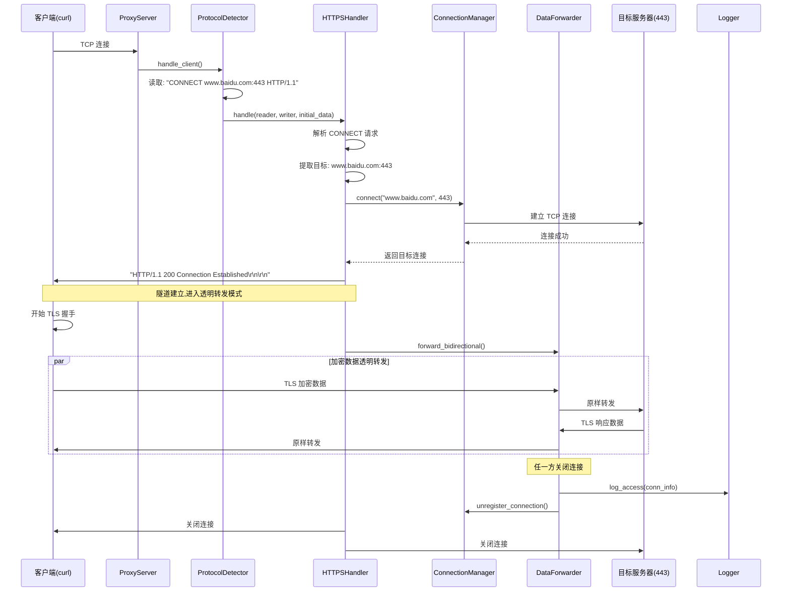
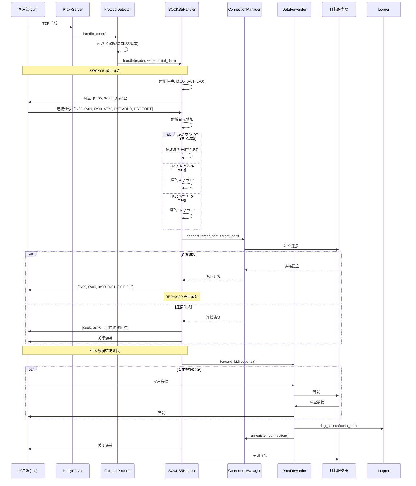

# EasyProxy 架构文档

## Introduction

本文档概述了 EasyProxy 项目的整体架构,包括后端系统、核心服务和技术实现细节。其主要目标是作为 AI 驱动开发的指导性架构蓝图,确保一致性并遵循选定的模式和技术。

EasyProxy 是一个轻量级、高性能的代理服务器,支持 HTTP/HTTPS/SOCKS5 协议。它设计为本地工具,类似于 dante,主要用于本地或内网环境的代理需求。

### Starter Template or Existing Project

**项目类型:** 全新的绿地项目(从零开始)

**技术方向:** 采用 asyncio + Python 标准库为主的方案,配合少量精选的第三方库。这样可以保持代码简洁、性能优秀,同时易于理解和维护。

**理由:**
- **Asyncio**: Python 3.7+ 原生支持,高性能异步 I/O,适合代理服务器的并发场景
- **最小依赖**: 减少安全风险和维护负担
- **协议实现**: HTTP/HTTPS 可用标准库扩展,SOCKS5 需要自定义但规范简单
- **可扩展性**: 后续可以轻松添加认证、日志、监控等功能

### Change Log

| Date | Version | Description | Author |
|------|---------|-------------|--------|
| 2025-10-05 | v1.0 | 初始架构设计 | Winston (Architect AI) |

---

## High Level Architecture

### Technical Summary

EasyProxy 是一个基于 **Python asyncio** 的高性能代理服务器,采用 **单体异步架构**。核心使用事件驱动模型处理多协议代理请求(HTTP/HTTPS/SOCKS5),通过协议处理器模式实现协议解析和转发逻辑的解耦。系统采用 **单进程多协程** 架构,利用 Python 原生异步 I/O 实现高并发连接处理。该架构直接支持项目目标:提供轻量级、易部署、高性能的代理解决方案,适合个人和小团队使用。

### High Level Overview

**1. 架构风格:** 单体异步架构 (Monolithic Async Architecture)
   - 单一 Python 进程运行
   - 基于 asyncio 事件循环
   - 协程并发模型

**2. 仓库结构:** 单仓库 (Single Repository)
   - 项目规模适中,单仓库足够
   - 便于版本管理和部署

**3. 服务架构:** 单服务多协议处理器
   - 统一的代理服务入口
   - 协议特定的处理器模块
   - 共享的连接管理和转发引擎

**4. 核心交互流程:**
   ```
   客户端请求 → 协议检测 → 协议处理器 → 目标连接建立 → 双向数据转发 → 连接关闭
   ```

**5. 关键架构决策:**
   - **Asyncio 而非多线程**: 避免 GIL 限制,更高的并发性能
   - **协议处理器模式**: 易于扩展新协议,代码模块化
   - **零拷贝转发**: 直接在 socket 间转发数据,减少内存开销
   - **配置驱动**: 通过配置文件控制行为,无需修改代码

### High Level Project Diagram



### Architectural and Design Patterns

- **异步 I/O 模式 (Async I/O Pattern):** 使用 Python asyncio 实现非阻塞 I/O 操作 - _理由:_ 代理服务器是 I/O 密集型应用,异步模式可以用单进程处理数千并发连接,避免多线程的 GIL 和上下文切换开销

- **策略模式 (Strategy Pattern):** 不同协议处理器实现统一接口 - _理由:_ HTTP、HTTPS、SOCKS5 有不同的握手和处理逻辑,策略模式使协议处理可插拔,便于测试和扩展

- **管道过滤器模式 (Pipe and Filter):** 数据流经协议解析 → 转发 → 日志记录 - _理由:_ 清晰的数据流向,每个组件职责单一,易于调试和性能优化

- **对象池模式 (Object Pool):** 复用连接和缓冲区对象 - _理由:_ 减少频繁创建销毁对象的开销,提高高并发场景下的性能

- **责任链模式 (Chain of Responsibility):** 协议检测按优先级尝试不同协议解析器 - _理由:_ 某些情况下协议特征不明显,需要按顺序尝试,失败则传递给下一个处理器

---

## Tech Stack

### Cloud Infrastructure

**Provider:** 不依赖特定云服务商 (Cloud Agnostic)

**部署方式:**
- 本地工具,直接运行或通过 systemd 管理
- 可运行在任何支持 Python 3.11+ 的环境

**关键服务:**
- 无云服务依赖
- 日志输出到文件或 stdout
- 监控通过 Prometheus 客户端暴露指标(可选)

**部署区域:** 本地或内网环境

### Technology Stack Table

| 类别 | 技术 | 版本 | 用途 | 理由 |
|------|------|------|------|------|
| **语言** | Python | 3.11+ | 主要开发语言 | 高性能,asyncio 成熟,生态丰富,开发效率高 |
| **运行时** | CPython | 3.11.8 | Python 解释器 | 官方实现,稳定可靠,社区支持最好 |
| **异步框架** | asyncio | 标准库 | 异步 I/O 核心 | Python 原生,无需额外依赖,性能优秀 |
| **配置管理** | PyYAML | 6.0.1 | YAML 解析 | 人类可读的配置格式 |
| **数据验证** | pydantic | 2.6+ | 配置和数据验证 | 类型安全,自动验证,优秀的错误提示 |
| **日志系统** | structlog | 24.1.0 | 结构化日志 | 易于解析,支持 JSON 输出,便于日志分析 |
| **命令行解析** | click | 8.1+ | CLI 接口 | 简洁的 API,自动生成帮助文档 |
| **测试框架** | pytest | 8.0+ | 单元和集成测试 | 强大的测试工具,丰富的插件生态 |
| **异步测试** | pytest-asyncio | 0.23+ | 异步代码测试 | 支持 asyncio 测试用例 |
| **代码格式化** | black | 24.2+ | 代码格式化 | 统一代码风格,零配置 |
| **代码检查** | ruff | 0.3+ | Linting 和格式检查 | 极快的 Python linter,替代 flake8/pylint |
| **类型检查** | mypy | 1.9+ | 静态类型检查 | 捕获类型错误,提高代码质量 |
| **依赖管理** | pip + venv | 标准库 | 包管理和虚拟环境 | Python 标准工具,简单直接,广泛支持 |
| **依赖锁定** | pip-tools | 7.4+ | 依赖版本锁定 | 生成 requirements.txt,确保可重现构建 |
| **监控(可选)** | prometheus_client | 0.20+ | 指标收集 | 标准的监控方案,易于集成 |

---

## Data Models

### Model 1: ProxyConfig (代理配置)

**Purpose:** 表示代理服务器的配置信息,从 YAML 文件加载并验证

**Key Attributes:**
- `host: str` - 监听地址 (默认: "0.0.0.0")
- `port: int` - 监听端口 (默认: 7899)
- `protocols: List[str]` - 启用的协议列表 ["http", "https", "socks5"]
- `max_connections: int` - 最大并发连接数 (默认: 1000)
- `timeout: int` - 连接超时时间(秒) (默认: 300)
- `buffer_size: int` - 数据缓冲区大小(字节) (默认: 8192)
- `log_level: str` - 日志级别 (默认: "INFO")
- `access_log: bool` - 是否记录访问日志 (默认: true)
- `auth: Optional[AuthConfig]` - 认证配置(可选)

**Relationships:**
- 包含一个可选的 `AuthConfig` 子配置
- 被 `ProxyServer` 使用来初始化服务器

**Validation Rules:**
- port 必须在 1-65535 范围内
- protocols 必须是有效的协议名称
- timeout 必须大于 0

### Model 2: AuthConfig (认证配置)

**Purpose:** 代理认证配置(可选功能,未来扩展)

**Key Attributes:**
- `enabled: bool` - 是否启用认证
- `type: str` - 认证类型 ("basic", "token")
- `users: Dict[str, str]` - 用户名密码映射(用于 basic 认证)

**Relationships:**
- 被 `ProxyConfig` 包含
- 被认证中间件使用

### Model 3: ConnectionInfo (连接信息)

**Purpose:** 表示单个代理连接的运行时信息,用于日志和监控

**Key Attributes:**
- `connection_id: str` - 唯一连接标识符 (UUID)
- `client_address: Tuple[str, int]` - 客户端地址和端口
- `target_host: str` - 目标主机名
- `target_port: int` - 目标端口
- `protocol: str` - 使用的协议 ("http", "https", "socks5")
- `start_time: datetime` - 连接建立时间
- `bytes_sent: int` - 发送字节数
- `bytes_received: int` - 接收字节数
- `status: str` - 连接状态 ("connecting", "established", "closed", "error")
- `error: Optional[str]` - 错误信息(如果有)

**Relationships:**
- 被 `ConnectionManager` 管理
- 用于生成访问日志和统计信息

### Model 4: ProxyRequest (代理请求)

**Purpose:** 表示解析后的代理请求信息,统一不同协议的请求格式

**Key Attributes:**
- `protocol: str` - 协议类型
- `method: Optional[str]` - HTTP 方法(仅 HTTP/HTTPS)
- `target_host: str` - 目标主机
- `target_port: int` - 目标端口
- `headers: Optional[Dict[str, str]]` - 请求头(仅 HTTP)
- `auth_provided: bool` - 是否提供了认证信息
- `raw_data: bytes` - 原始请求数据(用于转发)

**Relationships:**
- 由各协议处理器 (HTTPHandler, SOCKS5Handler) 创建
- 传递给 `ConnectionManager` 建立目标连接

### Model 5: ProxyStats (统计信息)

**Purpose:** 代理服务器运行统计信息,用于监控和管理接口

**Key Attributes:**
- `total_connections: int` - 总连接数
- `active_connections: int` - 当前活跃连接数
- `total_bytes_sent: int` - 总发送字节数
- `total_bytes_received: int` - 总接收字节数
- `connections_by_protocol: Dict[str, int]` - 按协议分类的连接数
- `error_count: int` - 错误连接数
- `uptime_seconds: float` - 运行时间(秒)
- `start_time: datetime` - 启动时间

**Relationships:**
- 由 `ProxyServer` 维护和更新
- 可通过管理接口查询

---

## Components

### Component 1: ProxyServer (代理服务器主控)

**Responsibility:** 
- 作为应用程序的入口点和主控制器
- 初始化所有子组件
- 启动 asyncio 事件循环和 TCP 监听器
- 管理服务器生命周期(启动、优雅关闭)
- 维护全局统计信息

**Key Interfaces:**
- `async def start() -> None` - 启动代理服务器
- `async def stop() -> None` - 优雅停止服务器
- `async def handle_client(reader, writer) -> None` - 处理新客户端连接
- `def get_stats() -> ProxyStats` - 获取统计信息

**Dependencies:** 
- ProtocolDetector (协议检测)
- ConnectionManager (连接管理)
- Logger (日志系统)
- ProxyConfig (配置)

**Technology Stack:** 
- asyncio.start_server() 创建 TCP 监听器
- signal 模块处理优雅关闭信号(SIGTERM, SIGINT)
- contextlib.asynccontextmanager 管理资源生命周期

### Component 2: ProtocolDetector (协议检测器)

**Responsibility:**
- 检测客户端使用的代理协议
- 读取连接的初始数据包
- 根据协议特征路由到相应的处理器
- 处理协议检测失败的情况

**Key Interfaces:**
- `async def detect(reader: StreamReader) -> Tuple[str, bytes]` - 检测协议并返回协议类型和初始数据
- `def _is_http_request(data: bytes) -> bool` - 判断是否为 HTTP 请求
- `def _is_socks5_handshake(data: bytes) -> bool` - 判断是否为 SOCKS5 握手

**Dependencies:**
- 无外部依赖,纯协议解析逻辑

**Technology Stack:**
- asyncio StreamReader 读取数据
- 正则表达式匹配 HTTP 请求行
- 字节序列匹配 SOCKS5 握手标识

### Component 3: HTTPHandler (HTTP 协议处理器)

**Responsibility:**
- 处理标准 HTTP 代理请求
- 解析 HTTP 请求行和头部
- 修改请求头(移除 Proxy-Connection 等)
- 转发请求到目标服务器
- 返回响应给客户端

**Key Interfaces:**
- `async def handle(reader, writer, initial_data: bytes) -> None` - 处理 HTTP 代理请求
- `def parse_request(data: bytes) -> ProxyRequest` - 解析 HTTP 请求
- `async def forward_request(request: ProxyRequest, target_writer) -> None` - 转发请求

**Dependencies:**
- ConnectionManager (建立目标连接)
- DataForwarder (双向数据转发)
- Logger (记录访问日志)

**Technology Stack:**
- http.client.HTTPMessage 解析 HTTP 头部
- 手动解析请求行(避免引入重型框架)
- asyncio 流式读写

### Component 4: HTTPSHandler (HTTPS/CONNECT 处理器)

**Responsibility:**
- 处理 HTTP CONNECT 方法(HTTPS 隧道)
- 建立到目标服务器的 TCP 连接
- 返回 "200 Connection Established" 响应
- 进入透明转发模式(不解密 TLS)

**Key Interfaces:**
- `async def handle(reader, writer, initial_data: bytes) -> None` - 处理 CONNECT 请求
- `def parse_connect_request(data: bytes) -> Tuple[str, int]` - 解析 CONNECT 目标
- `async def establish_tunnel(reader, writer, target_host, target_port) -> None` - 建立隧道

**Dependencies:**
- ConnectionManager (建立目标连接)
- DataForwarder (双向数据转发)
- Logger (记录连接日志)

**Technology Stack:**
- 正则表达式解析 CONNECT 请求
- asyncio 双向流转发
- 不涉及 SSL/TLS 处理(透明转发加密数据)

### Component 5: SOCKS5Handler (SOCKS5 协议处理器)

**Responsibility:**
- 实现 SOCKS5 协议握手流程
- 处理认证(当前支持无认证模式)
- 解析 SOCKS5 连接请求
- 建立目标连接并返回响应
- 进入数据转发阶段

**Key Interfaces:**
- `async def handle(reader, writer, initial_data: bytes) -> None` - 处理 SOCKS5 会话
- `async def handshake(reader, writer) -> bool` - 执行 SOCKS5 握手
- `async def parse_request(reader) -> ProxyRequest` - 解析 SOCKS5 请求
- `async def send_reply(writer, status: int, addr, port) -> None` - 发送 SOCKS5 响应

**Dependencies:**
- ConnectionManager (建立目标连接)
- DataForwarder (双向数据转发)
- Logger (记录连接日志)

**Technology Stack:**
- 手动实现 SOCKS5 协议(RFC 1928)
- struct 模块解析二进制协议
- 支持 IPv4/IPv6/域名地址类型

### Component 6: ConnectionManager (连接管理器)

**Responsibility:**
- 管理到目标服务器的连接
- 维护活跃连接池
- 处理连接超时和错误
- 记录连接统计信息
- 实现连接限制和资源控制

**Key Interfaces:**
- `async def connect(host: str, port: int, timeout: int) -> Tuple[StreamReader, StreamWriter]` - 建立目标连接
- `def register_connection(conn_info: ConnectionInfo) -> None` - 注册新连接
- `def unregister_connection(connection_id: str) -> None` - 注销连接
- `def get_active_connections() -> List[ConnectionInfo]` - 获取活跃连接列表
- `async def close_all() -> None` - 关闭所有连接

**Dependencies:**
- ProxyConfig (获取超时等配置)
- Logger (记录连接事件)

**Technology Stack:**
- asyncio.open_connection() 建立 TCP 连接
- asyncio.wait_for() 实现超时控制
- Dict[str, ConnectionInfo] 存储活跃连接
- asyncio.Lock 保护并发访问

### Component 7: DataForwarder (数据转发引擎)

**Responsibility:**
- 实现客户端和目标服务器之间的双向数据转发
- 高效的零拷贝数据传输
- 处理半关闭连接(half-close)
- 统计传输字节数
- 处理转发过程中的错误

**Key Interfaces:**
- `async def forward_bidirectional(client_reader, client_writer, target_reader, target_writer, conn_info: ConnectionInfo) -> None` - 双向转发
- `async def forward_stream(reader, writer, direction: str) -> int` - 单向转发并返回字节数

**Dependencies:**
- ConnectionInfo (更新传输统计)
- Logger (记录转发错误)

**Technology Stack:**
- asyncio.gather() 并发执行双向转发
- StreamReader.read(buffer_size) 读取数据
- StreamWriter.write() / drain() 写入数据
- try-except 处理连接中断

### Component 8: Logger (日志系统)

**Responsibility:**
- 提供统一的日志接口
- 记录访问日志(每个代理请求)
- 记录错误和调试信息
- 支持结构化日志输出
- 可配置的日志级别和格式

**Key Interfaces:**
- `def log_access(conn_info: ConnectionInfo) -> None` - 记录访问日志
- `def log_error(message: str, exc: Exception) -> None` - 记录错误
- `def log_info/debug/warning(message: str, **context) -> None` - 通用日志方法

**Dependencies:**
- ProxyConfig (获取日志配置)

**Technology Stack:**
- structlog 结构化日志库
- 标准库 logging 作为底层
- JSON 格式输出(便于日志分析)
- 支持输出到文件或 stdout

### Component 9: CLI (命令行接口)

**Responsibility:**
- 提供命令行入口
- 解析命令行参数
- 加载配置文件
- 启动代理服务器
- 处理信号和优雅关闭

**Key Interfaces:**
- `def main() -> None` - 主入口函数
- `def load_config(config_path: str) -> ProxyConfig` - 加载配置
- `def setup_logging(config: ProxyConfig) -> None` - 初始化日志

**Dependencies:**
- ProxyServer (启动服务器)
- ProxyConfig (配置管理)
- Logger (日志系统)

**Technology Stack:**
- click 命令行框架
- sys.exit() 退出码管理

---

## Core Workflows

### Workflow 1: HTTP 代理请求流程



### Workflow 2: HTTPS 隧道(CONNECT)流程



### Workflow 3: SOCKS5 代理流程



---

## Source Tree

```
easyproxy/
├── easyproxy/                      # 主应用包
│   ├── __init__.py                 # 包初始化,导出版本号
│   ├── __main__.py                 # 入口点: python -m easyproxy
│   │
│   ├── server.py                   # ProxyServer 主控制器
│   ├── config.py                   # ProxyConfig 配置模型
│   │
│   ├── protocol/                   # 协议处理模块
│   │   ├── __init__.py
│   │   ├── detector.py             # ProtocolDetector 协议检测
│   │   ├── base.py                 # BaseHandler 抽象基类
│   │   ├── http_handler.py         # HTTPHandler HTTP代理
│   │   ├── https_handler.py        # HTTPSHandler CONNECT隧道
│   │   └── socks5_handler.py       # SOCKS5Handler SOCKS5代理
│   │
│   ├── core/                       # 核心功能模块
│   │   ├── __init__.py
│   │   ├── connection.py           # ConnectionManager 连接管理
│   │   ├── forwarder.py            # DataForwarder 数据转发
│   │   └── models.py               # 数据模型(ConnectionInfo等)
│   │
│   ├── utils/                      # 工具模块
│   │   ├── __init__.py
│   │   ├── logger.py               # Logger 日志系统
│   │   └── exceptions.py           # 自定义异常类
│   │
│   └── cli.py                      # CLI 命令行接口
│
├── tests/                          # 测试目录
│   ├── __init__.py
│   ├── conftest.py                 # pytest 配置和 fixtures
│   │
│   ├── unit/                       # 单元测试
│   │   ├── __init__.py
│   │   ├── test_config.py          # 配置加载测试
│   │   ├── test_detector.py        # 协议检测测试
│   │   ├── test_http_handler.py    # HTTP处理器测试
│   │   ├── test_https_handler.py   # HTTPS处理器测试
│   │   ├── test_socks5_handler.py  # SOCKS5处理器测试
│   │   ├── test_connection.py      # 连接管理测试
│   │   └── test_forwarder.py       # 数据转发测试
│   │
│   ├── integration/                # 集成测试
│   │   ├── __init__.py
│   │   ├── test_http_proxy.py      # HTTP代理端到端测试
│   │   ├── test_https_proxy.py     # HTTPS代理端到端测试
│   │   └── test_socks5_proxy.py    # SOCKS5代理端到端测试
│   │
│   └── fixtures/                   # 测试数据
│       ├── sample_http_request.txt
│       ├── sample_socks5_handshake.bin
│       └── test_config.yaml
│
├── docs/                           # 文档目录
│   ├── architecture.md             # 本架构文档
│   ├── deployment.md               # 部署指南
│   └── development.md              # 开发指南
│
├── config/                         # 配置文件目录
│   ├── config.yaml                 # 默认配置文件
│   └── config.example.yaml         # 配置示例
│
├── scripts/                        # 辅助脚本(可选)
│   ├── setup_dev.sh                # 开发环境设置
│   └── run_tests.sh                # 运行测试
│
├── requirements.in                 # 直接依赖列表
├── requirements.txt                # 锁定的完整依赖(pip-compile生成)
├── requirements-dev.in             # 开发依赖列表
├── requirements-dev.txt            # 锁定的开发依赖
│
├── pyproject.toml                  # 项目元数据和工具配置
├── setup.py                        # 安装脚本(可选,用于pip install)
│
├── .gitignore                      # Git忽略文件
│
├── README.md                       # 项目说明
├── LICENSE                         # 开源协议
├── CHANGELOG.md                    # 变更日志
└── VERSION                         # 版本号文件
```

---

## Error Handling Strategy

### General Approach

**Error Model:** 分层错误处理模型
- **协议层错误**: 返回协议特定的错误响应(HTTP 502/503, SOCKS5 错误码)
- **连接层错误**: 记录日志并优雅关闭连接
- **系统层错误**: 捕获并防止服务器崩溃

**Exception Hierarchy:**
```python
ProxyException (基类)
├── ProtocolError (协议解析错误)
│   ├── InvalidHTTPRequest
│   ├── InvalidSOCKS5Handshake
│   └── UnsupportedProtocol
├── ConnectionError (连接相关错误)
│   ├── TargetUnreachable (目标不可达)
│   ├── ConnectionTimeout (连接超时)
│   ├── DNSResolutionError (DNS解析失败)
│   └── ConnectionRefused (连接被拒绝)
├── ForwardingError (转发错误)
│   ├── ClientDisconnected (客户端断开)
│   ├── TargetDisconnected (目标断开)
│   └── DataTransferError (数据传输错误)
└── ConfigurationError (配置错误)
    ├── InvalidConfig (无效配置)
    └── MissingConfig (缺少配置)
```

**Error Propagation:**
- **不向上传播**: 连接级错误不影响其他连接
- **记录并关闭**: 每个错误都记录日志,然后优雅关闭相关连接
- **用户友好**: 向客户端返回有意义的错误信息(不暴露内部细节)

### Logging Standards

**Library:** structlog 24.1.0 + 标准库 logging

**Format:** JSON 结构化日志(生产环境) 或 彩色控制台输出(开发环境)

**Log Levels Definition:**
- **DEBUG**: 详细的协议交互、数据包内容(开发调试用)
- **INFO**: 正常操作事件(连接建立、关闭、统计信息)
- **WARNING**: 非致命问题(连接超时、目标不可达)
- **ERROR**: 错误情况(协议解析失败、意外异常)
- **CRITICAL**: 严重错误(服务器无法启动、资源耗尽)

**Required Context:**
- **Correlation ID**: `connection_id` (UUID) - 追踪单个连接的所有日志
- **Service Context**: 
  - `component`: 组件名称(server, http_handler, socks5_handler等)
  - `protocol`: 使用的协议(http, https, socks5)
- **User Context**: 
  - `client_ip`: 客户端IP地址
  - `target`: 目标地址 (格式: host:port)
  - 不记录认证凭据或敏感数据

### Error Handling Patterns

#### External Connection Errors

**Retry Policy:** 不自动重试,由客户端决定

**Timeout Configuration:**
- **连接超时**: 30秒 (可配置 `connection_timeout`)
- **空闲超时**: 300秒 (可配置 `idle_timeout`)
- **DNS 解析超时**: 10秒

**Error Translation:**
```
DNSResolutionError → HTTP 502 Bad Gateway / SOCKS5 0x04 (Host unreachable)
ConnectionTimeout → HTTP 504 Gateway Timeout / SOCKS5 0x06 (TTL expired)
ConnectionRefused → HTTP 502 Bad Gateway / SOCKS5 0x05 (Connection refused)
```

#### Business Logic Errors

**User-Facing Errors:**
- **HTTP**: 返回标准 HTTP 错误响应 (400 Bad Request, 502 Bad Gateway等)
- **SOCKS5**: 返回 SOCKS5 错误码 (0x01-0x06)

#### Data Transfer Errors

**Transaction Strategy:** 无事务(代理服务器是无状态的)

**Idempotency:** 连接管理操作是幂等的(多次关闭同一连接安全)

---

## Coding Standards

### Core Standards

**Languages & Runtimes:**
- Python 3.11+ (必须使用类型注解)
- 使用 `asyncio` 进行所有 I/O 操作,禁止阻塞调用
- 禁止使用 `threading` 或 `multiprocessing`(除非明确需要)

**Style & Linting:**
- **Formatter**: Black (line-length=100)
- **Linter**: Ruff (替代 flake8/pylint)
- **Type Checker**: mypy (strict mode)
- 所有代码提交前必须通过: `black . && ruff check . && mypy .`

**Test Organization:**
- 测试文件命名: `test_<module_name>.py`
- 测试函数命名: `test_<function_name>_<scenario>`
- 异步测试使用 `pytest-asyncio` 的 `@pytest.mark.asyncio` 装饰器

### Naming Conventions

| Element | Convention | Example |
|---------|-----------|---------|
| 模块/包 | snake_case | `http_handler.py`, `protocol/` |
| 类名 | PascalCase | `ProxyServer`, `HTTPHandler` |
| 函数/方法 | snake_case | `handle_client()`, `parse_request()` |
| 常量 | UPPER_SNAKE_CASE | `MAX_CONNECTIONS`, `BUFFER_SIZE` |
| 私有成员 | _leading_underscore | `_parse_header()`, `_connection_id` |
| 异步函数 | async def snake_case | `async def connect_target()` |

### Critical Rules

- **类型注解强制**: 所有公共函数和方法必须有完整的类型注解(参数和返回值)
- **禁止裸 except**: 必须捕获具体的异常类型
- **日志而非 print**: 禁止使用 `print()`,必须使用 `logger` 对象
- **资源清理强制**: 所有网络连接必须在 `finally` 块或 `async with` 中关闭
- **配置驱动**: 所有可配置项必须从 `ProxyConfig` 读取,禁止硬编码
- **异常不吞噬**: 捕获异常后必须记录日志或重新抛出
- **协议处理器接口统一**: 所有协议处理器必须继承 `BaseHandler` 并实现 `handle()` 方法
- **日志结构化**: 日志必须使用结构化格式,不使用字符串格式化
- **避免阻塞调用**: 禁止在异步函数中调用阻塞的同步 I/O
- **错误信息安全**: 返回给客户端的错误信息不能包含内部实现细节或敏感信息

---

## Test Strategy and Standards

### Testing Philosophy

**Approach:** 测试驱动开发(TDD)优先,但不强制

**Coverage Goals:**
- **整体覆盖率**: 最低 80%
- **核心模块**: protocol/, core/ 要求 90%+
- **工具模块**: utils/ 要求 70%+

**Test Pyramid:**
- 60% 单元测试(独立组件)
- 30% 集成测试(组件协作)
- 10% 端到端测试(完整代理流程)

### Test Types and Organization

#### Unit Tests

**Framework:** pytest 8.0+ with pytest-asyncio 0.23+

**Location:** `tests/unit/` 对应源码结构

**Mocking Library:** `unittest.mock` (标准库) + `pytest-mock`

**Coverage Requirement:** 单个模块最低 80%

**AI Agent Requirements:**
- 为所有公共方法生成测试
- 覆盖正常路径和错误路径
- 遵循 AAA 模式 (Arrange, Act, Assert)
- Mock 所有外部依赖(网络、文件系统)

#### Integration Tests

**Scope:** 测试多个组件协作,使用真实的 asyncio 流

**Location:** `tests/integration/`

**Test Infrastructure:**
- **目标服务器**: 使用 `aiohttp` 启动本地测试服务器
- **代理服务器**: 启动真实的 ProxyServer 实例
- **客户端**: 使用 `aiohttp.ClientSession` 配置代理

#### End-to-End Tests

**Framework:** pytest with real curl commands

**Scope:** 使用真实的 curl 命令测试完整代理功能

**Environment:** 启动真实代理服务器,使用外部目标

### Continuous Testing

**本地测试:** 使用 pytest 运行所有测试

```bash
# 运行所有测试
pytest

# 运行单元测试
pytest tests/unit/

# 运行集成测试
pytest tests/integration/

# 生成覆盖率报告
pytest --cov=easyproxy --cov-report=html
```

---

## Security

### Input Validation

**Validation Library:** pydantic (配置验证) + 手动验证(协议数据)

**Validation Location:** 
- **配置验证**: 启动时通过 Pydantic 模型验证
- **协议验证**: 在各协议处理器的解析阶段验证
- **连接参数**: 在建立连接前验证目标地址和端口

**Required Rules:**
- 所有外部输入必须验证
- API 边界验证
- 白名单优于黑名单
- 长度限制防止内存耗尽攻击

### Authentication & Authorization

**Auth Method:** 可选的基本认证(未来扩展)

**Session Management:** 无会话(每个连接独立)

**Current Version:** 不实现认证(本地工具,信任本地客户端)

### Secrets Management

**Development:** 使用配置文件或环境变量

**Production:** 从环境变量读取敏感配置

**Code Requirements:**
- 禁止硬编码密钥
- 配置文件权限建议 600
- 日志中不记录密钥
- 错误消息不暴露敏感信息

### API Security

**Rate Limiting:** 基于连接数限制(通过 max_connections 配置)

**HTTPS Enforcement:** 
- 代理服务器本身监听明文端口(本地使用)
- HTTPS 流量保持端到端加密(透明转发)

### Data Protection

**Encryption at Rest:** 不适用(无数据持久化)

**Encryption in Transit:** 
- 客户端到代理: 明文(本地连接)
- 代理到目标: 保持原始协议
- HTTPS 流量: 端到端加密,代理不解密

**PII Handling:** 
- 不记录完整 URL
- 只记录目标主机名和端口
- 不记录请求体或响应体内容

**Logging Restrictions:**
- ❌ 禁止: 完整 URL, Authorization/Cookie 头, 请求/响应体, 认证凭据
- ✅ 允许: 客户端 IP, 目标主机和端口, HTTP 方法, 连接状态, 传输字节数

### Dependency Security

**Scanning Tool:** `pip-audit` (检查已知漏洞)

**Update Policy:** 
- 每月检查依赖更新
- 安全补丁立即更新
- 主版本更新需要测试验证

**Minimal Dependencies:** 优先使用标准库,避免不必要的第三方依赖

### Security Testing

**SAST Tool:** `bandit` - Python 安全静态分析

**Common Issues to Check:**
- 使用 `yaml.safe_load()` 而非 `yaml.load()`
- 避免 `eval()`, `exec()` 等危险函数
- 正确处理文件路径
- 输入验证和长度限制

---

## Next Steps

架构文档已完成!后续步骤:

1. **开始实现**: 使用 Dev Agent 根据此架构开始编码
2. **创建基础项目结构**: 按照 Source Tree 创建目录和文件
3. **实现核心组件**: 按照 Components 部分的设计实现各模块
4. **编写测试**: 遵循 Test Strategy 编写单元测试和集成测试

**开发优先级建议:**
1. 基础设施: 配置管理、日志系统、异常类
2. 核心组件: ConnectionManager, DataForwarder
3. 协议处理: ProtocolDetector, HTTPHandler, HTTPSHandler, SOCKS5Handler
4. 主控制器: ProxyServer, CLI
5. 测试和文档: 完善测试覆盖,编写用户文档

祝开发顺利! 🚀
